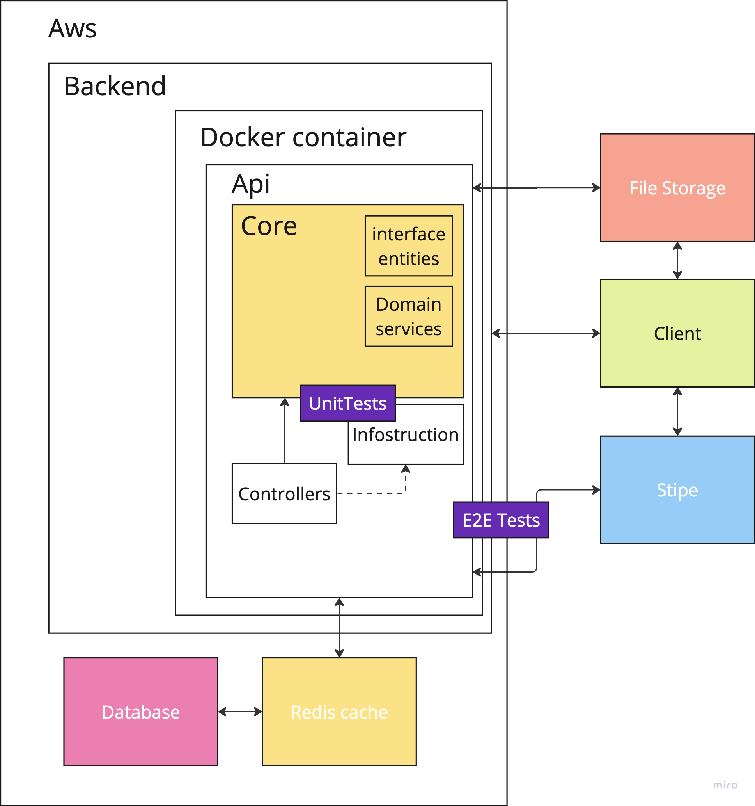

# Music Market architecture

1. Клиентское приложение:
- Разработка клиентского приложения на мобильном устройстве (iOS, Android) или веб-браузере.
- Реализация пользовательского интерфейса для просмотра, поиска и покупки музыкальных треков.
- Обеспечение функциональности для создания и управления плейлистами.
- Интеграция с платежными системами для обработки транзакций.

2. Бэкенд сервер:
- Разработка бэкенд-сервера для обработки логики приложения.
- Управление информацией о музыкальных треках, включая названия, авторов, жанры и обложки альбомов.
- Реализация системы управления пользователями, включая авторизацию, аутентификацию и управление профилями.
- Интеграция с платежными системами для обработки транзакций и управления подписками.
- Реализация механизмов поиска и фильтрации для удобного поиска треков.

3. Система хранения данных:
- Конфигурация и управление базой данных для хранения информации о музыкальных треках, пользователях и транзакциях.
- Реализация механизмов кэширования для обеспечения быстрой доступности данных.
- Резервное копирование данных и обеспечение их безопасности.

4. Сторонние сервисы и API:
- Интеграция с внешними сервисами для получения информации о музыкальных треках, таких как сервисы стриминга музыки или базы данных с метаданными.
- Интеграция с платежными платформами для обработки транзакций и управления подписками.
- Взаимодействие социальных сетей для обеспечения возможности делиться музыкой и покупками с друзьями.

Все приложение будет существовать на AWS, монолит завернутый в контейнер, что позволит производить легкое горизонтальное масштабирование, скопировав весь контейнер целиком.

В архитектуре существуют слудующие компоненты

+ API - проект.
+ Пользовательские интрефейсы/ Контроллер, которые обрабатывает входящие запросы.
+ Инфаструктура: - Репозитории, взаимодействующий с базой данных и хранилищем, а так же реализация сервисов, отвечающий за бизнес логику работы с платежами.
+ Ядро - самый центр приложения, которе не имеет зависимостей от других слоев приложения. 
+ Бизнес entity пользователя, содержащие поля для него и методы работы.
+ Доменные службы, которые реализуют интерфейсы.
+ File storage - место в котором будут храниться все файлы (Картинки и музыка).
+ Database , Redis cache - элементы базы даннынх.
 
Бизнес entity и Доменные службы находятся за пределами ядра и зависят от него, но ни в коем случае наоборот. Это образует "чистую архитектуру", 
которая предоставляет слабую сцепку и независимость от реалезации, что предоствляет гибкость  
И позволяет не зависить от реалезации и достаточно четко разделять бизнес сущности для вынесение в случае надобности в 
отдельные програмы или заменить базу данных или хранилище

В решении с чистой архитектурой для каждого проекта четко определены обязанности. Фактически, каждому проекту будут принадлежать определенные типы, а в проектах будут представлены соответствующие этим типам папки.

Реализация сервисов должна быть покрыта юнит тестами.
Интеграция с платежной системой e2e тестами.

(Solid и DRY)

